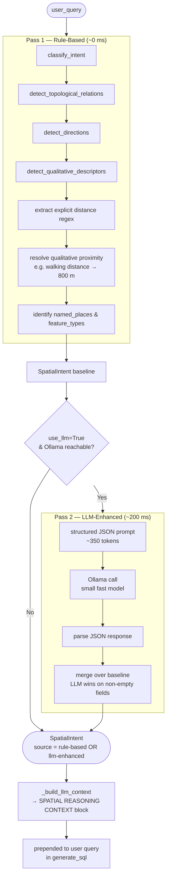
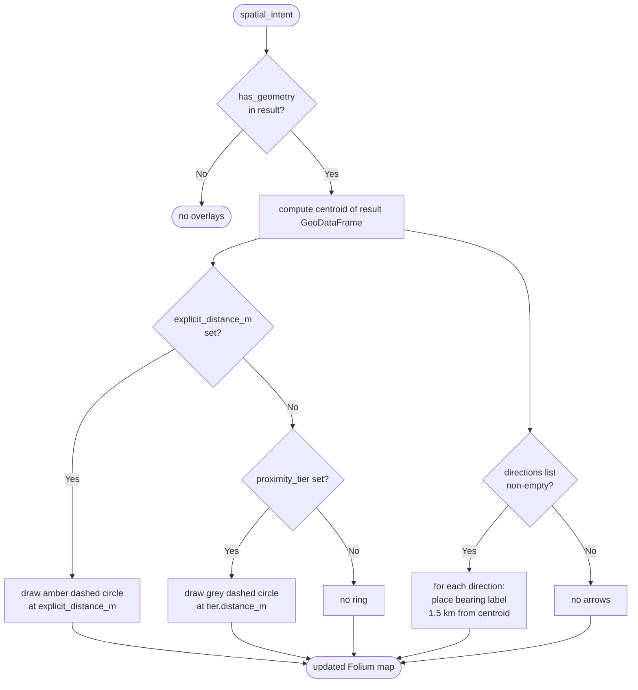
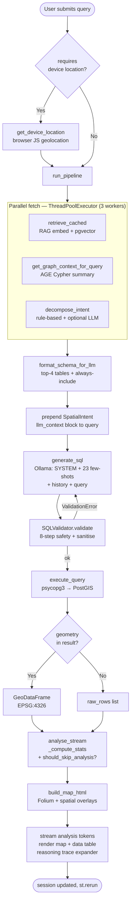
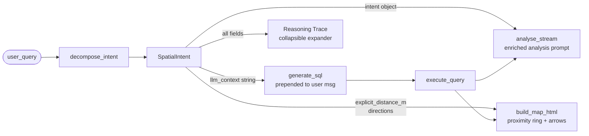

# Geo-Agentic Spatial Search — Architecture & Developer Reference

> **Audience:** Engineers picking this repository up for the first time.  
> **Purpose:** Explain every component, data flow, design decision, and integration point in enough detail that you can modify, extend, or debug any part of the system without needing to read every source file first.

---

## Table of Contents

1. [System Overview](#1-system-overview)
2. [Repository Layout](#2-repository-layout)
3. [Infrastructure — Docker & PostgreSQL](#3-infrastructure--docker--postgresql)
4. [Database Schema](#4-database-schema)
5. [Data Ingestion Pipeline (`data/setup_db.py`)](#5-data-ingestion-pipeline)
6. [Core Modules](#6-core-modules)
   - [db.py — Connection Pool](#61-dbpy--connection-pool)
   - [schema.py — Schema Introspection](#62-schemapy--schema-introspection)
   - [rag.py — Hybrid RAG](#63-ragpy--hybrid-rag)
   - [validator.py — SQL Validator](#64-validatorpy--sql-validator)
   - [llm.py — LLM Integration](#65-llmpy--llm-integration)
   - [executor.py — Query Executor](#66-executorpy--query-executor)
   - [analyst.py — Spatial Analysis Agent](#67-analystpy--spatial-analysis-agent)
   - [graph.py — Apache AGE Interface](#68-graphpy--apache-age-interface)
   - [geocoder.py — Map Centering](#69-geocoderpy--map-centering)
   - [spatial_concepts.py — Spatial Ontology](#610-spatial_conceptspy--spatial-ontology)
   - [spatial_reasoner.py — Semantic Reasoning Layer](#611-spatial_reasonerpy--semantic-reasoning-layer)
7. [Application Layer (`app.py`)](#7-application-layer-apppy)
8. [End-to-End Request Flow](#8-end-to-end-request-flow)
9. [Key Design Decisions](#9-key-design-decisions)
10. [Environment Variables](#10-environment-variables)
11. [Performance Architecture](#11-performance-architecture)
12. [Extending the System](#12-extending-the-system)

---

## 1. System Overview

```
┌─────────────────────────────────────────────────────────────────────────┐
│                          User's Browser                                 │
│                  Streamlit UI  (3 tabs: Chat / Map / Graph)             │
└──────────────────────────────┬──────────────────────────────────────────┘
                               │  HTTP (localhost:8501)
                               ▼
┌─────────────────────────────────────────────────────────────────────────┐
│                          app.py  (Streamlit server)                     │
│                                                                         │
│  ┌──────────┐   ┌─────────────┐   ┌──────────────┐   ┌──────────────┐  │
│  │ RAG cache │   │ LLM (SQL)   │   │  Executor    │   │  Analyst     │  │
│  │ core/rag  │   │ core/llm    │   │  core/exec   │   │  core/anal.  │  │
│  └────┬─────┘   └──────┬──────┘   └──────┬───────┘   └──────┬───────┘  │
└───────┼────────────────┼─────────────────┼──────────────────┼──────────┘
        │                │                 │                  │
        ▼                ▼                 ▼                  ▼
┌──────────────┐  ┌─────────────┐  ┌─────────────────────────────────────┐
│  Ollama      │  │  Ollama     │  │   PostgreSQL 15  (geospatial_db)    │
│  nomic-embed │  │  gemma4:    │  │                                     │
│  -text-v2    │  │  31b-cloud  │  │  PostGIS 3.6  pgvector 0.8         │
│              │  │  (SQL gen + │  │  Apache AGE 1.6  pg_trgm           │
│  768-dim     │  │   analysis) │  │                                     │
│  embeddings  │  └─────────────┘  │  12 OSM tables + views + matview   │
└──────────────┘                   │  table_descriptions (RAG index)    │
                                   │  osm_spatial (property graph)      │
                                   └─────────────────────────────────────┘
```

The system is a **natural-language spatial search engine** over Adelaide's OpenStreetMap data. A user types a plain-English question; the system generates a PostGIS SQL query, executes it, renders results on an interactive map, and streams a short LLM interpretation back to the user.

**Technology stack at a glance:**

| Layer | Technology |
|---|---|
| UI | Streamlit |
| LLM (SQL gen + analysis) | Ollama → `gemma4:31b-cloud` |
| Embedding | Ollama → `nomic-embed-text-v2-moe` (768-dim) |
| Vector search | pgvector `<=>` cosine similarity |
| Spatial DB | PostgreSQL 15 + PostGIS 3.6 |
| Graph DB | Apache AGE 1.6 (openCypher, same PG instance) |
| Name search | pg_trgm GIN indexes |
| Map rendering | Folium (Leaflet.js) |
| OSM data source | osmnx |
| Containerisation | Docker Compose (single container) |

---

## 2. Repository Layout

```
geospatial/
├── app.py                    # Streamlit application — UI, pipeline orchestration
├── docker-compose.yml        # Single-service Docker Compose (PostgreSQL)
├── Dockerfile                # AGE base + pgvector source build + PostGIS apt
├── .env                      # Environment variables (not committed)
│
├── core/                     # Pure-Python backend modules (no Streamlit imports)
│   ├── db.py                 # psycopg3 connection pool singleton
│   ├── schema.py             # DB schema introspection → TableInfo dataclasses
│   ├── rag.py                # Hybrid RAG: embed query → pgvector similarity search
│   ├── validator.py          # SQL safety validator + sanitiser
│   ├── llm.py                # SQL generation + analysis LLM calls (Ollama / OpenAI)
│   ├── executor.py           # Execute SQL → QueryResult + GeoDataFrame
│   ├── analyst.py            # Compute stats + streaming LLM spatial summary
│   ├── graph.py              # Apache AGE openCypher interface
│   └── geocoder.py           # Adelaide map centre coordinate (startup only)
│
├── data/
│   └── setup_db.py           # One-time data loader: OSM download → PostGIS → embeddings → AGE graph
│
└── docker/
    └── initdb.sql            # DDL: extensions, tables, indexes, views, matview
```

---

## 3. Infrastructure — Docker & PostgreSQL

### 3.1 Dockerfile

```
apache/age:release_PG15_1.6.0   (PostgreSQL 15 + Apache AGE pre-installed)
        │
        ├── apt-get: build-essential, postgresql-server-dev-15,
        │            postgresql-15-postgis-3, postgresql-15-postgis-3-scripts
        │
        ├── git clone pgvector v0.8.0 → make OPTFLAGS="" → make install
        │   (OPTFLAGS="" disables -march=native which causes SIGSEGV in Docker)
        │
        └── COPY docker/initdb.sql → /docker-entrypoint-initdb.d/01_initdb.sql
```

`initdb.sql` runs **automatically on the first container start** (PostgreSQL convention for files placed in `/docker-entrypoint-initdb.d/`). It creates all extensions, tables, indexes, and views. On subsequent starts it is skipped because the data volume already exists.

### 3.2 docker-compose.yml

```yaml
# Single service: geospatial_db on port 5432
# Memory tuning injected via postgres command-line flags:
shared_buffers=512MB        # ~25% of container RAM; hot page cache
effective_cache_size=1536MB # query planner hint for OS page cache
work_mem=32MB               # per-sort/hash — raised from 4MB default
maintenance_work_mem=128MB  # speeds VACUUM, CLUSTER, index builds
random_page_cost=1.1        # SSD-tuned; default 4.0 is for spinning disk
```

```
┌─────────────────────────────────────────────────────┐
│  Docker volume: pgdata (persists across restarts)   │
│                                                     │
│  Container: geospatial_db                           │
│    port 5432 → localhost:5432                       │
│    healthcheck: pg_isready -U geo -d geospatial     │
└─────────────────────────────────────────────────────┘
```

---

## 4. Database Schema

### 4.1 Extensions

```sql
CREATE EXTENSION IF NOT EXISTS postgis;          -- spatial types, ST_* functions
CREATE EXTENSION IF NOT EXISTS postgis_topology; -- topology support
CREATE EXTENSION IF NOT EXISTS vector;           -- pgvector: vector(N) type + <=> operator
LOAD 'age';
CREATE EXTENSION IF NOT EXISTS age;              -- Apache AGE: openCypher in SQL
CREATE EXTENSION IF NOT EXISTS pg_trgm;          -- trigram indexes for ILIKE
```

### 4.2 OSM Spatial Tables (12 tables)

All tables share the same base schema; layer-specific columns differ.

```
osm_schools        Point/Polygon  amenity, addr:street, addr:housenumber, operator, opening_hours
osm_hospitals      Point/Polygon  amenity, addr:street, addr:housenumber, operator, opening_hours
osm_restaurants    Point/Polygon  amenity, cuisine, addr:street, addr:housenumber, opening_hours
osm_pharmacies     Point/Polygon  amenity, addr:street, addr:housenumber, operator, opening_hours
osm_roads          LineString     highway, surface, lanes, maxspeed, oneway
osm_waterways      LineString     waterway
osm_railways       LineString     railway
osm_parks          Polygon        leisure
osm_buildings      Polygon        building, addr:street, addr:housenumber   (≤5000 rows sampled)
osm_landuse        Polygon        landuse
osm_natural        Polygon        natural
osm_boundaries     MultiPolygon   boundary, admin_level   (LGA=6, suburb=8)
```

All geometry columns use **SRID 4326 (WGS-84)**. Each table has:
- `GIST` index on `geometry` for spatial queries
- `GIN pg_trgm` index on `name` for fast `ILIKE` lookups

### 4.3 Views and Materialized Views

```
osm_all       VIEW              12-table UNION ALL (id, osm_id, name, layer, geometry)
              Used in SQL generation as a cross-layer lookup target

osm_all_mat   MATERIALIZED VIEW Same 12-table union but physically stored
              Indexes: UNIQUE(id,layer), GIST(geometry), GIN trgm(name)
              Refresh: REFRESH MATERIALIZED VIEW CONCURRENTLY osm_all_mat;
              ~0.4ms ILIKE via trgm vs full seq scan of all 12 tables
```

### 4.4 RAG Index Table

```sql
table_descriptions (
    id          serial PRIMARY KEY,
    table_name  text NOT NULL UNIQUE,
    description text NOT NULL,
    embedding   vector(768)        -- nomic-embed-text-v2-moe embedding of description
)
```

One row per OSM table. The embedding is computed during `setup_db.py` and used by `core/rag.py` for cosine-similarity schema retrieval.

### 4.5 Apache AGE Property Graph (`osm_spatial`)

Stored inside PostgreSQL's `ag_catalog` schema.

```
Node labels (one per table):
  School, Hospital, Restaurant, Pharmacy, Road, Waterway,
  Railway, Park, Building, Landuse, NaturalFeature, Boundary

Node properties: fid (int), name (str), suburb (str)

Edge types:
  NEAR   — distance ≤ 500m between two features of specific label pairs
  WITHIN — feature centroid is within an administrative boundary polygon

NEAR edge pairs (8):
  School→Park, School→Hospital, School→Restaurant,
  Restaurant→Park, Restaurant→Restaurant,
  Hospital→Pharmacy, Pharmacy→Hospital,
  Park→Waterway

WITHIN edges: all 10 feature layers → Boundary nodes
```

### 4.6 Entity-Relationship Diagram

```
┌─────────────────┐         ┌──────────────────────────────────────────┐
│ table_descriptions│         │              osm_* tables (12)           │
│─────────────────│         │──────────────────────────────────────────│
│ id (PK)         │         │ id         bigserial PK                  │
│ table_name      │◄──────  │ osm_id     bigint (OSM feature ID)       │
│ description     │  RAG    │ name       text (trgm index)             │
│ embedding vec   │  index  │ geometry   geometry(*, 4326) (GiST)      │
└─────────────────┘         │ <layer columns>                          │
                             └──────────────┬───────────────────────────┘
                                            │
                             ┌──────────────▼───────────────────────────┐
                             │            osm_all (VIEW)                │
                             │  UNION ALL of all 12 tables              │
                             │  id, osm_id, name, layer, geometry       │
                             └──────────────┬───────────────────────────┘
                                            │  materialised copy
                             ┌──────────────▼───────────────────────────┐
                             │          osm_all_mat (MAT VIEW)          │
                             │  + GiST, trgm, unique(id,layer) indexes │
                             └──────────────────────────────────────────┘

┌───────────────────────────────────────────────────────────────────────┐
│                    AGE graph: osm_spatial                             │
│                                                                       │
│  (School {fid,name,suburb}) ──[NEAR {distance_m}]──► (Park)          │
│  (School) ──[NEAR]──► (Hospital)                                      │
│  (Hospital) ──[NEAR]──► (Pharmacy)                                    │
│  ... (8 NEAR pairs total)                                             │
│                                                                       │
│  (School) ──[WITHIN]──► (Boundary {name="Norwood"})                  │
│  (Restaurant) ──[WITHIN]──► (Boundary {name="Adelaide CBD"})         │
│  ... (10 layers → Boundary)                                           │
└───────────────────────────────────────────────────────────────────────┘
```

---

## 5. Data Ingestion Pipeline

`data/setup_db.py` is run **once** to populate the database. It has four sequential phases:

```
python data/setup_db.py [--skip-download] [--skip-graph]
```

```
Phase 1: verify_extensions()
  └─ Checks postgis, vector, age are installed
  └─ Fails fast if any extension is missing

Phase 2: run_data_load()   (skipped with --skip-download)
  └─ For each of 12 LAYER_DEFS:
       osmnx.features_from_place("Adelaide, South Australia, Australia", tags=...)
       → GeoDataFrame → reproject to EPSG:4326
       → INSERT INTO osm_<layer> (psycopg3 executemany, WKT geometry)
       (osm_buildings sampled to 5000 rows to bound table size)

Phase 3: run_embedding_index()
  └─ For each LAYER_DEF description text:
       ollama.embed(model=EMBEDDING_MODEL, input=description) → 768-dim vector
       → UPSERT INTO table_descriptions

Phase 4: run_perf_indexes()
  └─ CREATE EXTENSION pg_trgm
  └─ GIN trgm indexes on all 12 name columns
  └─ Partial GiST on osm_boundaries (admin_level 8/9/10)
  └─ CREATE MATERIALIZED VIEW osm_all_mat + its 3 indexes
  └─ CLUSTER osm_roads, osm_parks, osm_buildings, osm_landuse on GiST index
  └─ ANALYZE all tables

Phase 5: run_graph_build()  (skipped with --skip-graph)
  └─ DROP + recreate AGE graph "osm_spatial"
  └─ CREATE nodes: for each row in each OSM table → AGE node with label+properties
  └─ CREATE WITHIN edges:
       for each feature layer × boundary:
         ST_Within(feature.geometry, boundary.geometry) → WITHIN edge
  └─ CREATE NEAR edges:
       for each of 8 label pairs:
         ST_DWithin(a.geometry, b.geometry, 500m/111000) → NEAR edge with distance_m
```

### Data flow diagram

```
  osmnx API (OpenStreetMap Overpass)
         │
         │  features_from_place()  (12 separate queries)
         ▼
  GeoDataFrame (EPSG:4326)
         │
         │  psycopg3 executemany  (WKT)
         ▼
  osm_* PostGIS tables  (12 tables)
         │
         ├──► Ollama embed(description) ──► table_descriptions.embedding
         │
         ├──► run_perf_indexes() ──► GIN/GiST indexes + matview
         │
         └──► AGE cypher() ──► osm_spatial graph nodes + edges
```

---

## 6. Core Modules

### 6.1 `db.py` — Connection Pool

```
┌──────────────────────────────────────────────────────┐
│  get_pool()  →  psycopg_pool.ConnectionPool          │
│   min_size=1, max_size=5                             │
│   row_factory=dict_row  (rows as dicts, not tuples)  │
│   configure=_configure_connection                    │
│                  │                                   │
│                  ▼ called on every new connection    │
│   _configure_connection():                           │
│     LOAD 'age';                                      │
│     SET search_path = ag_catalog, "$user", public;   │
│     (makes Cypher functions visible in every conn)   │
└──────────────────────────────────────────────────────┘

Usage pattern everywhere in core/:
    with get_conn() as conn:
        with conn.cursor() as cur:
            cur.execute(...)
```

Connection parameters come from env vars: `DB_HOST`, `DB_PORT`, `DB_NAME`, `DB_USER`, `DB_PASSWORD`.

---

### 6.2 `schema.py` — Schema Introspection

Reads live table structure from PostgreSQL on app startup (cached in Streamlit for 5 minutes).

```
introspect_db()
  │
  ├─ SELECT table_name FROM information_schema.tables
  │    WHERE table_schema IN ('public', 'ag_catalog')
  │    AND table_name LIKE 'osm_%'
  │
  ├─ For each table:
  │    ├─ SELECT column_name, data_type FROM information_schema.columns
  │    ├─ SELECT type, srid FROM geometry_columns
  │    ├─ SELECT COUNT(*) FROM <table>
  │    └─ SELECT DISTINCT <col> LIMIT 5 (sample values for text columns)
  │
  └─ Returns list[TableInfo]

TableInfo dataclass:
  name, columns: list[ColumnInfo], row_count, geometry_column,
  geometry_type, srid, sample_values

format_schema_for_llm(tables) → str
  Produces concise token-efficient schema string injected into LLM prompt:
  "TABLE osm_schools (423 rows) (geometry: POINT, SRID=4326):
     - name: text  -- e.g. 'Norwood Primary', 'St Peter's College'
     - amenity: text  -- e.g. 'school'
     - geometry: POINT (SRID=4326)"
```

---

### 6.3 `rag.py` — Hybrid RAG

The problem: the full schema for 12 tables is ~3,000 tokens. Injecting it on every call is wasteful and pushes other context out. RAG reduces this to ~800 tokens (top-4 relevant tables).

```
┌───────────────────────────────────────────────────────────────────────┐
│                         Hybrid RAG Flow                               │
│                                                                       │
│  user_query  ──► Ollama embed (nomic-embed-text-v2-moe, 768-dim)      │
│                        │                                              │
│                        ▼                                              │
│              pgvector cosine similarity search                        │
│              SELECT table_name FROM table_descriptions                │
│              ORDER BY embedding <=> query_vec LIMIT 4                 │
│                        │                                              │
│                        ▼                                              │
│              top-4 relevant table names                               │
│              + always include {osm_all, osm_boundaries}               │
│                        │                                              │
│                        ▼                                              │
│              filtered schema text (~800 tokens)                       │
└───────────────────────────────────────────────────────────────────────┘

Caching architecture:

  retrieve_cached(query)
       │
       ▼
  _retrieve_cached_impl(query, model, top_k)   ← @lru_cache(maxsize=512)
       │                                          keyed on (query, model, top_k)
       ▼                                          returns tuple[str,...] | None
  HybridRAG.retrieve(query)
       │
       ├─ _embed(query)  → Ollama API (~178ms cold)
       └─ pgvector query (~1ms)

  Cache hit: 0.01ms (26,000× faster than cold call)

Prefetch strategy:
  prefetch(queries)          — background ThreadPoolExecutor, warms cache for
                               EXAMPLE_QUERIES list on app startup
  prefetch_async(query)      — fires on every text_input on_change event,
                               so embed is in-flight while user finishes typing
```

---

### 6.4 `validator.py` — SQL Validator

Every SQL string from the LLM passes through `SQLValidator.validate()` before execution.

```
validate(sql: str) → str  (raises ValidationError on failure)

Step 1: _strip_markdown()
  Remove ```sql ... ``` fences. Anchors on WITH (CTEs) before SELECT
  so the WITH prefix is never accidentally stripped.

Step 2: Forbidden pattern check (regex)
  - DML/DDL: INSERT, UPDATE, DELETE, DROP, ALTER, TRUNCATE, CREATE, GRANT, REVOKE
  - EXECUTE / EXEC
  - COPY (file read)
  - pg_read_file, pg_ls_dir (filesystem access)
  - Statement stacking: ";" followed by non-whitespace
  - ST_Extent (returns SRID 0, breaks downstream)

Step 3: Parse with sqlparse
  stmt_type must be "SELECT" or None (None = CTE starting with WITH)

Step 4: Table validation
  _extract_tables() — extract FROM/JOIN table refs, exclude CTE names
  Check against allowed_tables set (from RAG + ALWAYS_INCLUDE)
  Reject HALLUCINATED_TABLES (e.g. "suburb", "boundary", "location")

Step 5: Function whitelist check
  _extract_functions() → compare against ALLOWED_FUNCTIONS set
  (~60 PostGIS + standard SQL functions)

Step 6: ORDER BY alias expansion
  Replaces aliases in ORDER BY with full expressions to avoid
  "column not found" errors in PostgreSQL

Step 7: Quote colon columns
  OSM columns like addr:street → "addr:street" (unquoted causes parse error)

Step 8: Auto-inject LIMIT 500
  If no LIMIT clause present

Step 9: Ensure trailing semicolon
```

---

### 6.5 `llm.py` — LLM Integration

The largest module (~1,100 lines). Contains the system prompt, 23 few-shot examples, SQL generation loop, and analysis calls.

#### SQL Generation (`generate_sql`)

```
generate_sql(user_query, schema_context, allowed_tables,
             device_coords=None, model=OLLAMA_MODEL,
             max_retries=3, conversation_history=[])

┌─────────────────────────────────────────────────────────────────────┐
│  Attempt loop (up to 3 retries)                                     │
│                                                                     │
│  Messages sent to Ollama:                                           │
│  ┌──────────────────────────────────────────────────────────────┐   │
│  │ SYSTEM: SYSTEM_PROMPT (rules + schema_context)               │   │
│  │ USER:   few_shot[0].user                                      │   │
│  │ ASST:   few_shot[0].assistant  (SQL)                          │   │
│  │  ... (23 few-shot pairs) ...                                  │   │
│  │ USER:   history[0].user   ← last N conversation turns        │   │
│  │ ASST:   history[0].sql    ← SQL only (not full response)     │   │
│  │  ... (up to CONVERSATION_HISTORY_TURNS=3 pairs) ...          │   │
│  │ USER:   user_query  [+ device location if "near me"]         │   │
│  └──────────────────────────────────────────────────────────────┘   │
│                                                                     │
│  options: temperature=0, seed=42+attempt, num_predict=1024,        │
│           num_ctx=8192                                              │
│                                                                     │
│  Response → SQLValidator.validate(sql)                             │
│  If ValidationError → retry with error feedback appended           │
│                                                                     │
│  Returns (sql, None) on success                                     │
│  Returns ("", error_str) after all retries exhausted               │
└─────────────────────────────────────────────────────────────────────┘
```

#### System Prompt Key Rules

- Output ONLY a valid PostGIS SELECT (no markdown, no explanation)
- Use only tables/columns from `{schema_context}` — never invent names
- Place name resolution via subquery only: `(SELECT geometry FROM osm_boundaries WHERE name ILIKE '%Norwood%' LIMIT 1)`
- Device GPS injected only for "near me" queries; all other places resolved in DB
- Always use `ST_AsGeoJSON(geometry)` alias `geometry` for map rendering
- Default `LIMIT 100`, never omit it
- UNION ALL pattern for comparison queries (geometry rows first, stat rows last)

#### Few-Shot Examples (23 patterns)

| # | Pattern | Key SQL technique |
|---|---|---|
| 1 | Nearest N to named place | `ST_Distance` + `ORDER BY` + subquery place lookup |
| 2 | Radius from named place | `ST_DWithin` + subquery |
| 3 | Features in suburb | `ST_Within` + boundary subquery |
| 4 | Attribute filter | `WHERE highway = 'primary'` |
| 5 | Largest polygons by area | `ST_Area` + `ORDER BY` |
| 6 | Cross-layer intersection | `ST_Intersects` JOIN |
| 7 | Count/aggregate | `GROUP BY` + `COUNT(*)` |
| 8 | Name search | `ILIKE '%creek%'` |
| 9 | Near me (device GPS) | Injected `ST_MakePoint(lng, lat)` literal |
| 10 | Compare two feature types | UNION ALL with `feature_type` label column |
| 11 | Radius from landmark | `ST_DWithin` with named place subquery |
| 12 | Density per suburb | `ST_Area` denominator + suburb join |
| 13 | Multi-type count in area | Three subquery counts + UNION ALL |
| 14 | NOT EXISTS gap analysis | `NOT EXISTS (SELECT 1 FROM ... ST_DWithin ...)` |
| 15 | Landuse types in suburb | `ST_Intersects` + `GROUP BY landuse` |
| 16 | Most isolated features | `NOT EXISTS` with distance threshold |
| 17 | Largest landuse areas | `ST_Area` + `ORDER BY` |
| 18a-d | Green vs concrete ratio | CTE `stats` + UNION ALL polygon rows + metric rows |
| 19 | Suburb cafe density ranking | `COUNT / ST_Area` + `ORDER BY` |
| 20 | NOT EXISTS variant | Schools without nearby restaurants |
| 21 | Features near waterway | `ST_DWithin` with waterway name search |
| 22 | Count per suburb | Suburb boundary join + `GROUP BY` |
| 23 | Lateral join nearest | `CROSS JOIN LATERAL (SELECT ... ORDER BY ST_Distance LIMIT 1)` |

#### Analysis LLM (`generate_analysis` / `generate_analysis_stream`)

```
Priority order for analysis model:
  1. ANALYSIS_MODEL + ANALYSIS_API_KEY set → OpenAI-compatible API (streaming)
  2. ANALYSIS_MODEL set, no key            → Ollama (streaming, optional thinking)
  3. Neither set                           → falls back to OLLAMA_MODEL via Ollama

should_skip_analysis(result) → True when:
  - result.row_count == 0
  - Single-row, ≤2 column result (scalar like COUNT(*))
  - Small (≤5 rows) all-numeric result
  Saves ~1.9s per trivial query
```

---

### 6.6 `executor.py` — Query Executor

```
execute_query(sql: str) → QueryResult

  with get_conn() as conn:
    conn.cursor().execute(sql)
    rows = cur.fetchall()     (dict_row factory → list[dict])

  Geometry detection (samples first row):
    1. Try ST_AsGeoJSON string  → shapely.from_geojson()
    2. Try WKB bytes            → shapely.from_wkb()
    3. Try WKT string           → shapely.from_wkt()

  If geometry found:
    → GeoDataFrame(crs="EPSG:4326")  stored as result.gdf
    → result.has_geometry = True

  If no geometry:
    → result.raw_rows = list[dict]
    → result.gdf = None

QueryResult dataclass:
  gdf:          GeoDataFrame | None
  columns:      list[str]
  row_count:    int
  has_geometry: bool
  error:        str | None
  raw_rows:     list[dict] | None
```

---

### 6.7 `analyst.py` — Spatial Analysis Agent

```
analyse_stream(user_query, sql, result) → AnalysisResult
  │
  ├─ _compute_stats(result)
  │    └─ count, geometry_types, sample_names, unique_names
  │       distance_stats (min/max/avg), area_stats (total/largest)
  │       top_<amenity|highway|waterway|...>
  │
  ├─ _generate_followups(user_query, stats)
  │    └─ 3 heuristic follow-up query suggestions
  │
  └─ should_skip_analysis(result)?
       ├─ YES → return AnalysisResult(summary=fallback, stream=None)
       └─ NO  → return AnalysisResult(summary="", stream=generate_analysis_stream(...))
                 (stream is a generator yielding text chunks)

AnalysisResult dataclass:
  summary:   str           (empty "" when streaming; filled by app.py)
  stats:     dict
  followups: list[str]
  stream:    Generator | None
```

---

### 6.8 `graph.py` — Apache AGE Interface

```
graph is available?
  SELECT name FROM ag_graph WHERE name = 'osm_spatial'  → True/False

_cypher(query: str) → list[dict]
  with get_conn() as conn:
    LOAD 'age';
    SET search_path = ag_catalog, "$user", public;
    SELECT * FROM cypher('osm_spatial', $$ {query} $$) AS (result agtype);
  Returns [] on any failure (graph optional — app works without it)

get_graph_summary() → dict
  MATCH ()-[r:NEAR]->() RETURN type(r), count(r)
  MATCH ()-[r:WITHIN]->() RETURN type(r), count(r)
  Returns: {"near": {"School→Park": N, ...}, "near_total": N,
            "within": {...}, "within_total": N}

get_graph_context_for_query(query: str) → str
  Returns a 1-line string appended to rag_schema before SQL gen:
  "[Graph: 12345 NEAR relationships, 6789 WITHIN relationships available]"
  Empty string if graph unavailable (non-blocking)
```

---

### 6.9 `geocoder.py` — Map Centering

```python
get_adelaide_center() → (-34.9285, 138.6007)
```

Used **only** for the default Folium map center on startup. All place name resolution during queries is done inside PostGIS via LLM-generated subqueries. No external geocoding API is called at runtime.

---

### 6.10 `spatial_concepts.py` — Spatial Ontology

Defines the complete vocabulary for semantic spatial reasoning. No LLM required — pure Python dataclasses and dictionaries.

| Concept class | Contents | Example |
|---|---|---|
| `ProximityTier` | Named distance bands with labels and descriptions | walking distance ≤800 m, nearby ≤3 km |
| `SizeThreshold` | Park/polygon size categories with m² bounds | large > 50,000 m² |
| `DirectionalRelation` | 8-direction bearing ranges + PostGIS hint | north: azimuth < 22.5° or > 337.5° |
| `TOPOLOGICAL_RELATIONS` | Keyword lists → PostGIS operator strings | "within" → `ST_Within` |
| `QUALITATIVE_DESCRIPTORS` | Fuzzy adjectives → quantitative thresholds | "walkable" → dist_m=800 |
| `IntentType` | Taxonomy of spatial query types | proximity_search, gap_analysis, density_ranking… |

**Key functions:**

- `classify_intent(text)` — returns ordered list of detected `IntentType` keys
- `detect_directions(text)` — cardinal/ordinal direction keywords → direction names
- `detect_topological_relations(text)` — topological relation keywords detected
- `detect_qualitative_descriptors(text)` — qualitative adjectives detected
- `classify_proximity(distance_m)` → `ProximityTier`

---

### 6.11 `spatial_reasoner.py` — Semantic Reasoning Layer

The **central addition** for semantic spatial reasoning. Runs in two phases:

#### Pre-query: `decompose_intent(query, use_llm=True)`

Runs concurrently with RAG retrieval and graph context fetching. Returns a `SpatialIntent` dataclass.

**Two-pass decomposition:**

1. **Rule-based pass** (always, ~0 ms) — uses `spatial_concepts.py` keyword matching:
   - Classify primary and secondary intents
   - Detect topological relations, directions, qualitative descriptors
   - Extract explicit distances from text ("2km", "500 metres")
   - Resolve qualitative proximity ("walking distance" → 800 m)
   - Identify named places and feature types

2. **LLM-enhanced pass** (optional, ~200 ms) — short Ollama call with a structured JSON prompt:
   - Produces the same fields as rule-based, but with semantic understanding
   - Merged _over_ the rule-based baseline (LLM wins on non-empty fields)
   - Gracefully degrades if Ollama is unavailable

**`SpatialIntent` fields:**

| Field | Type | Description |
|---|---|---|
| `primary_intent` | str | Top-level intent type (e.g. `proximity_search`) |
| `secondary_intents` | list[str] | Additional intents detected |
| `topological_relations` | list[str] | Spatial operators needed |
| `directions` | list[str] | Directional constraints (north, east…) |
| `qualitative_descriptors` | list[str] | Fuzzy adjectives (large, dense, walkable…) |
| `explicit_distance_m` | float\|None | Metres extracted from text or qualitative tier |
| `proximity_tier` | str\|None | Human label for the distance |
| `named_places` | list[str] | Proper nouns found |
| `feature_types` | list[str] | OSM feature types mentioned |
| `postgis_hints` | list[str] | Recommended PostGIS operator expressions |
| `reasoning_notes` | list[str] | Short observations about the spatial challenge |
| `llm_context` | str | `[SPATIAL REASONING CONTEXT]` block for SQL gen prompt |
| `source` | str | `"rule-based"` or `"llm-enhanced"` |

**`llm_context` injection:** The context block is prepended to the user query before being passed to `generate_sql()`. The SQL-generation LLM uses it to select correct operators, thresholds, and patterns.

#### Post-query: `explain_results(intent, stats, user_query)`

Builds an enriched analysis prompt (instead of the generic one) that:
- Names the intent type explicitly
- References topological relations used
- Mentions directional constraints and asks whether results cluster in that direction
- Includes qualitative context and asks the LLM to interpret it against actual data
- Provides distance range interpretation with proximity tier labels

Used by `analyst.py` → `generate_analysis_stream()`.

#### UI: Reasoning Trace Panel

After each query result, a collapsible **"Spatial Reasoning Trace"** expander shows:
- Intent type and secondary intents
- Spatial operators selected
- Directional/qualitative context with thresholds
- Distance and proximity tier
- Named places extracted
- PostGIS hints derived
- Source badge (rule-based / llm-enhanced)

#### Map: Spatial Overlays

When spatial intent is available, `build_map_html()` adds:
- **Proximity ring** — dashed circle at the search radius centred on the result centroid (amber for explicit distance, grey for fuzzy)
- **Directional arrows** — bearing labels (↑ North, → East, etc.) placed 1.5 km from the centroid in each detected direction

#### Spatial Reasoner Two-Pass Decomposition



#### Map Overlay Decision Logic



---

## 7. Application Layer (`app.py`)

### 7.1 Session State

```python
st.session_state = {
    "messages":               [],        # list of message dicts (user + assistant)
    "current_map_html":       None,      # latest rendered Folium map HTML string
    "current_gdf":            None,      # latest GeoDataFrame (for basemap re-renders)
    "basemap_selection":      "Dark",    # user's chosen basemap
    "device_location":        None,      # (lat, lng) from browser, if granted
    "pending_location_query": None,      # query waiting for GPS resolution
    "location_request_key":   0,         # increments to re-trigger JS geolocation
    "active_tab":             0,         # 0=Chat, 1=Map, 2=Graph
    "rag_prefetched":         False,     # guard: prefetch() called only once
}
```

### 7.2 UI Layout

```
┌─────────────────────────────────────────────────────────────────┐
│  st.title("Geo-Agentic Spatial Search")                         │
│  Tabs: [Chat] [Map] [Graph Explorer]          [Sidebar]        │
├───────────────────────────────────┬─────────────────────────────┤
│  Tab: Chat                        │  Sidebar                    │
│  ┌─────────────────────────────┐  │  Model: gemma4:31b-cloud    │
│  │ col_tools (1/3 width)       │  │  History turns: 3           │
│  │  ▼ Database Schema          │  │  [Clear conversation]       │
│  │  ▼ Example queries          │  │                             │
│  └─────────────────────────────┘  │                             │
│                                   │                             │
│  ── conversation history ──       │                             │
│  [user] query text                │                             │
│  [assistant] N results found      │                             │
│              summary (streamed)   │                             │
│              metric cards         │                             │
│              [View SQL]           │                             │
│              [Statistics]         │                             │
│              [Data Table]         │                             │
│              follow-up chips      │                             │
│                                   │                             │
│  [text_input: draft]  on_change→prefetch_async()               │
│  [chat_input: Submit query]                                     │
├───────────────────────────────────┤                             │
│  Tab: Map                         │                             │
│  [basemap selector]               │                             │
│  components.html(folium map, h=700)│                            │
├───────────────────────────────────┤                             │
│  Tab: Graph Explorer              │                             │
│  [Graph Statistics] metric cards  │                             │
│  [Example Cypher] chips           │                             │
│  [text_area: Cypher query]        │                             │
│  [Run Cypher] → DataFrame results │                             │
└───────────────────────────────────┴─────────────────────────────┘
```

### 7.3 Map Rendering

```
build_map_html(gdf, basemap, device_coords)
  │
  ├─ folium.Map(location=adelaide_center, zoom_start=12)
  ├─ max_bounds=True, min_zoom=7, max_zoom=18
  ├─ bounds clamped to SA_BOUNDS=[[-38.5,128.0],[-26.0,141.0]]
  │   (prevents pan/zoom outside South Australia)
  │
  ├─ For each feature in gdf:
  │    colour = FEATURE_TYPE_COLORS.get(feature_type)
  │             or GEOM_COLORS.get(geom_type, "#e74c3c")
  │    folium.GeoJson(feature, style={color, fillColor, ...})
  │    popup: name + layer + feature_type (if present)
  │
  ├─ fit_bounds(gdf.total_bounds) — clamped to SA_BOUNDS
  └─ Returns HTML string → components.html(html, height=700)

Colour scheme:
  Points:           red     (#e74c3c)
  Lines:            blue    (#3498db)
  Polygons:         green   (#2ecc71 / #27ae60)
  feature_type=park:     green  (#27ae60)
  feature_type=building: orange (#e67e22)
  feature_type=cafe:     purple (#9b59b6)
  feature_type=school:   blue   (#3498db)
  feature_type=hospital: red    (#e74c3c)
  feature_type=pharmacy: amber  (#f39c12)
```

---

## 8. End-to-End Request Flow

### 8.1 High-Level Pipeline (Mermaid)



### 8.2 Detailed Step-by-Step (ASCII)

```
User types query in text_input (draft)
       │
       ▼ on_change fires
prefetch_async(draft)                  [background thread, non-blocking]
       │
       ▼ _retrieve_cached_impl() submits to _executor ThreadPoolExecutor
  Ollama embed(draft) → pgvector search → result cached in @lru_cache

User hits Enter / clicks chat_input Submit
       │
       ▼ _process_query(query)
       │
       ├─[1] append {"role":"user"} to session messages
       │
       ├─[2] device location check
       │      query_requires_device_location()?
       │      YES → get_device_location() → wait for browser JS → coords
       │      NO  → proceed with device_coords=None
       │
       ├─[3] st.spinner("Thinking...")
       │      run_pipeline(query, ...) ──────────────────────────────────┐
       │                                                                  │
       │      ┌────────────────────────────────────────────────────────┐ │
       │      │  ThreadPoolExecutor (2 workers, concurrent):           │ │
       │      │    rag_future   = retrieve_cached(query)               │ │
       │      │    graph_future = get_graph_context_for_query(query)   │ │
       │      │                                                        │ │
       │      │  retrieve_cached():                                    │ │
       │      │    cache hit?  → return instantly (0.01ms)            │ │
       │      │    cache miss? → Ollama embed + pgvector (~178ms)     │ │
       │      │                                                        │ │
       │      │  result: top-4 relevant table names                   │ │
       │      │          + always: osm_all, osm_boundaries            │ │
       │      │                                                        │ │
       │      │  filtered schema = format_schema_for_llm(top4 tables) │ │
       │      │                  + graph_ctx string (if available)    │ │
       │      └────────────────────────────────────────────────────────┘ │
       │                                                                  │
       │      history = _build_conversation_history(messages, 3)         │
       │      (last 3 user/assistant pairs, assistant content = SQL only) │
       │                                                                  │
       │      generate_sql(query, rag_schema, allowed_tables, history)   │
       │        → Ollama: SYSTEM_PROMPT + 23 few-shots + history + query │
       │        → raw SQL string                                          │
       │        → SQLValidator.validate(sql)                             │
       │        → retry up to 3× with error feedback                    │
       │                                                                  │
       │      execute_query(sql)                                          │
       │        → psycopg3 → PostGIS                                     │
       │        → auto-detect geometry → GeoDataFrame                    │
       │                                                                  │
       │      analyse_stream(query, sql, result)                         │
       │        → _compute_stats(result)                                 │
       │        → should_skip_analysis()? → skip LLM if trivial         │
       │        → returns AnalysisResult(stream=generator)              │
       │                                                                  │
       │      build_map_html(gdf, basemap)                               │
       │      split UNION ALL rows (geom vs stat)                        │
       │      return result_msg dict + _stream generator                 │
       │                                                                  │◄──┘
       ├─[4] stream is not None?
       │      YES → st.chat_message + st.write_stream(stream)
       │             tokens render live as LLM generates them
       │             accumulated text saved as result_msg["summary"]
       │      NO  → fallback summary string
       │
       ├─[5] session_state["messages"].append(result_msg)
       │     session_state["current_map_html"] = map_html
       │
       └─[6] st.rerun()
              → UI rerenders with new message + map visible
```

### 8.3 SpatialIntent Data Flow



### UNION ALL response handling

Comparison queries (green vs buildings, suburb ranking, etc.) return rows in two groups:

```sql
-- Group 1: geometry rows (map-renderable)
SELECT 'park' AS feature_type, NULL AS count, ST_AsGeoJSON(geometry) AS geometry ...
UNION ALL
-- Group 2: stat rows (metric cards)
SELECT 'green_area_m2' AS feature_type, 48234.5 AS count, NULL AS geometry ...
```

`run_pipeline` splits these after execution:
- `geom_rows` → `table_df` (shown in Data Table expander)
- `count_rows` → `analysis.stats["comparison"]` (shown as `st.metric` cards)

---

## 9. Key Design Decisions

### No geocoder at query time

All place-name resolution happens inside PostGIS subqueries generated by the LLM:

```sql
-- LLM generates this — no lat/lng hardcoding:
WHERE ST_Within(s.geometry,
    (SELECT geometry FROM osm_boundaries
     WHERE name ILIKE '%Norwood%' LIMIT 1))
```

**Why:** Eliminates Nominatim rate-limits, network round-trips, and result inconsistency. The LLM learns the pattern from few-shot examples.

**Exception:** "Near me" queries inject the browser GPS coordinate as a literal `ST_MakePoint(lng, lat)` — this is the only runtime coordinate injection.

### RAG over full schema injection

The LLM receives ~800 tokens of relevant schema rather than ~3,000 tokens of full schema. Benefits:
- Reduces prompt size → faster time-to-first-token
- Reduces hallucination of irrelevant table/column names
- `ALWAYS_INCLUDE = {osm_all, osm_boundaries}` ensures place lookup always works

### Pre-emptive RAG caching

`prefetch(EXAMPLE_QUERIES)` warms the LRU cache for all 20 example queries on first app load (background threads). `prefetch_async()` fires on every `on_change` event from the draft text input. By the time the user submits, the embed is already done.

### `osm_all` as view vs `osm_all_mat` as matview

- `osm_all` (VIEW): always fresh, used in LLM-generated SQL
- `osm_all_mat` (MATERIALIZED VIEW): pre-computed, has its own GiST + trgm indexes — intended for fast cross-layer name lookup in app-level code (not LLM SQL)
- Refresh after data reload: `REFRESH MATERIALIZED VIEW CONCURRENTLY osm_all_mat;`

### SRID 4326 everywhere

All geometries stored and returned in WGS-84. `ST_DWithin` uses geography type for accurate metre-based distance thresholds. `ST_Area` uses `ST_Transform(geom, 7844)` (GDA2020) for accurate square-metre calculations.

### Streaming analysis

`generate_analysis_stream()` yields tokens from the LLM. `st.write_stream()` renders them live. The user sees the summary building word-by-word rather than waiting 1.9s for the full response — perceived latency drops significantly.

### skip_analysis guard

`should_skip_analysis()` skips the analysis LLM call for:
- 0-row results ("no features found")
- COUNT(*) style queries (1 row, 1 numeric column)
- Small all-numeric tables (≤5 rows)

Saves ~1.9s LLM latency for ~30% of queries.

---

## 10. Environment Variables

| Variable | Default | Purpose |
|---|---|---|
| `DB_HOST` | `localhost` | PostgreSQL host |
| `DB_PORT` | `5432` | PostgreSQL port |
| `DB_NAME` | `geospatial` | Database name |
| `DB_USER` | `geo` | DB username |
| `DB_PASSWORD` | `geo` | DB password |
| `OLLAMA_HOST` | `http://localhost:11434` | Ollama API base URL |
| `OLLAMA_MODEL` | `gemma4:e4b` | Model for SQL generation |
| `EMBEDDING_MODEL` | `nomic-embed-text` | Model for RAG embeddings (768-dim) |
| `ANALYSIS_MODEL` | _(unset)_ | Model for spatial analysis summary |
| `ANALYSIS_API_KEY` | _(unset)_ | API key for OpenAI-compatible analysis model |
| `ANALYSIS_THINKING` | `false` | Enable chain-of-thought for Ollama analysis model |

**Current `.env` (production):**
```
OLLAMA_MODEL=gemma4:31b-cloud
EMBEDDING_MODEL=nomic-embed-text-v2-moe
ANALYSIS_MODEL=gemma4:31b-cloud
ANALYSIS_THINKING=true
```

`gemma4:31b-cloud` is a remote-proxied model via `ollama.com:443`. Auth is via `~/.ollama/` session key. Requires internet. TTFT is ~515ms (network RTT) — this is the dominant latency source.

---

## 11. Performance Architecture

### Latency profile (gemma4:31b-cloud)

| Operation | Latency | Notes |
|---|---|---|
| RAG embed (cold) | ~178ms | Ollama local embed model |
| RAG embed (warm cache hit) | 0.01ms | `@lru_cache` |
| pgvector cosine search | ~1ms | |
| SQL generation TTFT | ~515ms | Network RTT to ollama.com |
| SQL generation (50 tokens) | ~1.3s | |
| Analysis LLM (80 tokens) | ~1.9s | Streamed — first token at ~515ms |
| PostGIS simple query | ~19ms | |
| PostGIS ST_DWithin subquery | ~11ms | |
| PostGIS ILIKE (trgm) | ~0.4ms | After pg_trgm GIN index |
| **Total pipeline (typical)** | **~3–5s** | Simple queries |
| **Total pipeline (complex)** | **10–30s** | Thinking-enabled analysis |

### Concurrency model

```
run_pipeline():
  ThreadPoolExecutor(max_workers=2):
    ┌─ retrieve_cached()              (RAG + embed)
    └─ get_graph_context_for_query()  (AGE Cypher)
  Both run in parallel; saved ~178ms vs sequential

prefetch():
  _executor = ThreadPoolExecutor(max_workers=2, thread_name_prefix="rag_prefetch")
  Warms EXAMPLE_QUERIES cache on app load (background, non-blocking)

prefetch_async():
  Same executor, single-query fire-and-forget
  Triggered by text_input on_change
```

### Index strategy

```
Query type                    Index used
─────────────────────────────────────────────────────────────────
ST_DWithin radius search      GiST on geometry (each table)
ST_Within suburb lookup       GiST on osm_boundaries
admin_level 8/9/10 suburb     Partial GiST (admin_level IN 8,9,10)
ILIKE name search             GIN pg_trgm on name
Cross-layer ILIKE search      GIN pg_trgm on osm_all_mat.name
Sequential range scan         CLUSTER on GiST (osm_roads, parks, buildings, landuse)
pgvector cosine similarity    pgvector ivfflat/hnsw (default)
```

---

## 12. Extending the System

### Add a new OSM layer

1. Add to `LAYER_DEFS` in `data/setup_db.py`:
   ```python
   ("osm_cafes", {"amenity": "cafe"}, "Cafes in Adelaide...")
   ```
2. Add `TABLE_COLUMNS["osm_cafes"]` entry
3. Add `AGE_LABELS["osm_cafes"] = "Cafe"`
4. Add DDL in `docker/initdb.sql` (table + GiST index)
5. Add to `osm_all` VIEW and `osm_all_mat` MATERIALIZED VIEW definitions
6. Re-run `python data/setup_db.py --skip-download` to embed + index
7. Add to `FEATURE_TYPE_COLORS` in `app.py` if you want a specific map colour

### Add a new few-shot SQL pattern

Add to `FEW_SHOT_EXAMPLES` in `core/llm.py`:
```python
{"role": "user",      "content": "Your example question"},
{"role": "assistant", "content": "SELECT ... FROM osm_... WHERE ...;"},
```

Patterns at the end of the list are lower-priority; place important new patterns near similar existing ones.

### Change the LLM model

Update `.env`:
```
OLLAMA_MODEL=llama3.1:8b         # local
ANALYSIS_MODEL=gpt-4o            # cloud
ANALYSIS_API_KEY=sk-...
```

The system prompt and few-shots are model-agnostic. Smaller models may need `num_ctx` reduced in `generate_sql()` options.

### Add a new AGE edge type

In `run_graph_build()` in `data/setup_db.py`, add a new block following the NEAR pattern:
```python
# e.g. ADJACENT_TO edges between parks and waterways
for park in parks:
    for waterway in nearby_waterways:
        _age_exec(conn, f"""
            MATCH (a:Park {{fid: {park.fid}}}), (b:Waterway {{fid: {waterway.fid}}})
            CREATE (a)-[:ADJACENT_TO {{distance_m: {dist}}}]->(b)
        """)
```

Then update `get_graph_summary()` and `get_graph_context_for_query()` in `core/graph.py` to include the new edge type in the LLM context string.

### Refresh osm_all_mat after data reload

```sql
REFRESH MATERIALIZED VIEW CONCURRENTLY osm_all_mat;
```

The `CONCURRENTLY` option allows reads during refresh (no table lock). Requires the unique index `osm_all_mat_id_layer_idx`.

### Clear the RAG LRU cache

The cache is in-process. It auto-evicts at 512 entries (LRU). To force a full clear:
```python
from core.rag import _retrieve_cached_impl
_retrieve_cached_impl.cache_clear()
```

---

*Generated from source — commit `b859053` on branch `dev`.*
