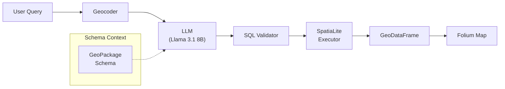
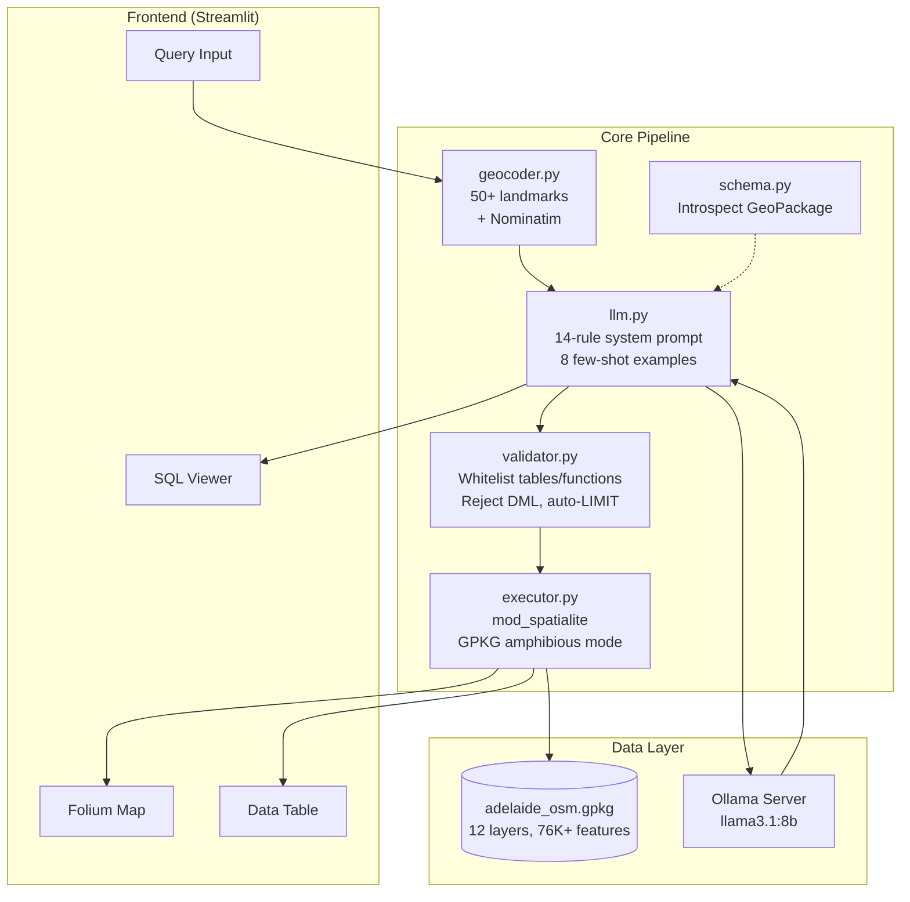
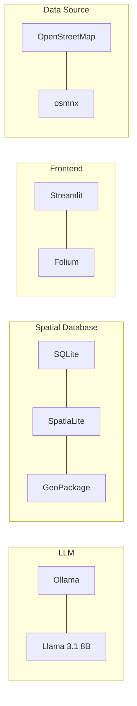
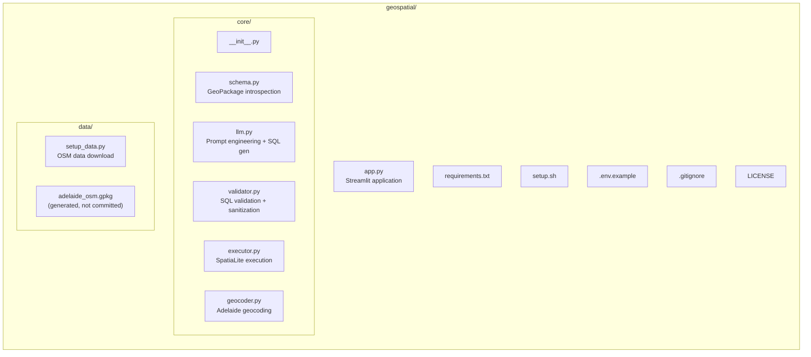

# Natural Language Spatial Search

A proof-of-concept Streamlit application that translates natural language queries into SpatiaLite SQL and visualizes spatial results on an interactive map. Ask questions like *"show me 5 schools near Adelaide CBD"* and get results plotted on a Folium map.

## How It Works



1. **Natural language input** -- you type a plain-English spatial question.
2. **Geocoding** -- place names (e.g. "Glenelg Beach") are resolved to lat/lon coordinates using a local Adelaide landmark dictionary with Nominatim fallback.
3. **SQL generation** -- the query, coordinates, and database schema are sent to a local Llama 3.1 8B model (via Ollama) which produces a SpatiaLite SELECT statement.
4. **Validation** -- the generated SQL is validated against a whitelist of tables and functions, checked for DML/DDL injection, and auto-limited.
5. **Execution** -- the SQL runs against a GeoPackage database (SQLite + SpatiaLite extension) containing Adelaide OpenStreetMap data.
6. **Visualization** -- results are converted to a GeoDataFrame and rendered on an interactive Folium map inside Streamlit.

## Architecture



## Tech Stack



## Dataset

Adelaide, South Australia -- 12 OSM layers covering:

| Layer | Type | Description |
|-------|------|-------------|
| schools | Point/Polygon | Schools |
| hospitals | Point/Polygon | Hospitals |
| restaurants | Point/Polygon | Restaurants, cafes, pubs, bars |
| pharmacies | Point/Polygon | Pharmacies |
| roads | LineString | Major road network |
| waterways | LineString | Rivers, streams, canals |
| railways | LineString | Railway lines |
| parks | Polygon | Parks, gardens, nature reserves |
| buildings | Polygon | Buildings (sampled to 5000) |
| landuse | Polygon | Land use zones |
| natural | Polygon | Water bodies, woods, wetlands |
| boundaries | MultiPolygon | Administrative boundaries |

## Prerequisites

- **Python 3.11+** (tested with 3.14)
- **Ollama** installed and running ([install guide](https://ollama.com/download))
- **libspatialite** system library
- **Git** (to clone the repo)

### Install system dependencies

**macOS (Homebrew):**

```bash
brew install spatialite-tools libspatialite
```

**Ubuntu / Debian:**

```bash
sudo apt-get install -y libsqlite3-mod-spatialite spatialite-bin
```

**Arch Linux:**

```bash
sudo pacman -S libspatialite
```

## Quick Start

The included setup script handles everything -- virtual environment, Python dependencies, Ollama model, and data download:

```bash
git clone <repo-url> geospatial
cd geospatial
chmod +x setup.sh
./setup.sh
```

Then launch the app:

```bash
source .venv/bin/activate
streamlit run app.py
```

## Manual Setup

If you prefer to set things up step by step:

```bash
# 1. Create and activate virtual environment
python3 -m venv .venv
source .venv/bin/activate

# 2. Install Python dependencies
pip install -r requirements.txt

# 3. Pull the Ollama model
ollama pull llama3.1:8b

# 4. Download Adelaide OSM data (builds data/adelaide_osm.gpkg)
python data/setup_data.py

# 5. (Optional) Copy and edit environment config
cp .env.example .env

# 6. Run the app
streamlit run app.py
```

## Configuration

Environment variables (set in `.env` or export directly):

| Variable | Default | Description |
|----------|---------|-------------|
| `OLLAMA_HOST` | `http://localhost:11434` | Ollama server URL |
| `OLLAMA_MODEL` | `llama3.1:8b` | Ollama model to use |
| `GPKG_PATH` | `data/adelaide_osm.gpkg` | Path to the GeoPackage database |

## Example Queries

- "Find 5 schools near Adelaide CBD"
- "Show me restaurants within 2km of Glenelg Beach"
- "What are the largest parks by area?"
- "Show all primary roads"
- "How many restaurants are there by type?"
- "Find parks with 'creek' in the name"
- "Show me hospitals near the University of Adelaide"
- "Show all waterways"

## Project Structure



## Known Limitations

- The LLM (Llama 3.1 8B) sometimes generates invalid SQL -- the validator catches most issues and the system retries up to 3 times.
- Distance calculations use degree-based approximation (`ST_Distance * 111320` for meters), which is not perfectly accurate at Adelaide's latitude.
- The geocoder covers ~50 Adelaide landmarks; uncommon places fall back to Nominatim which requires an internet connection.
- SpatiaLite does not support all PostGIS functions -- the system prompt guides the LLM toward compatible syntax.

## License

This project is licensed under the MIT License. See [LICENSE](LICENSE) for details.

Map data from [OpenStreetMap](https://www.openstreetmap.org/copyright) contributors, available under the [ODbL](https://opendatacommons.org/licenses/odbl/).
