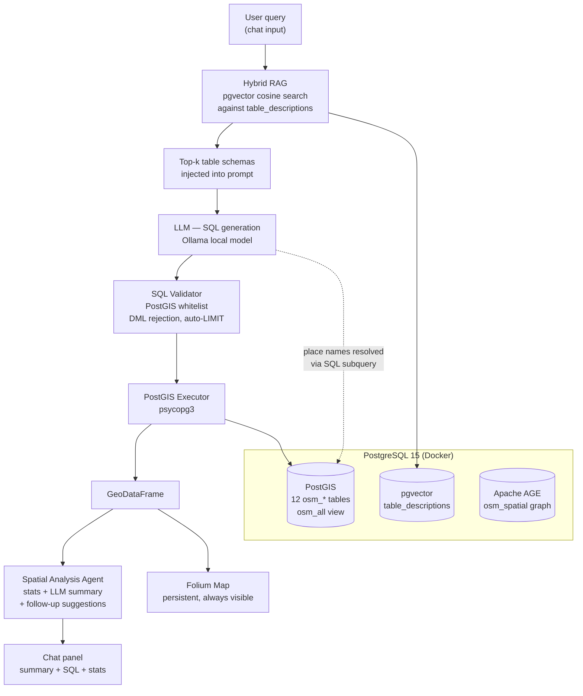
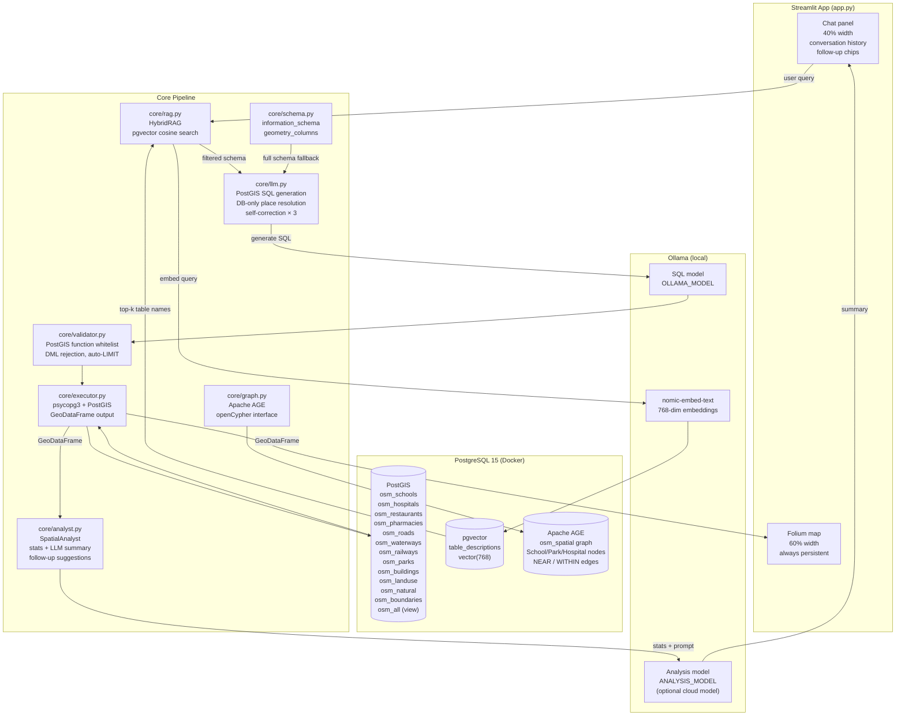
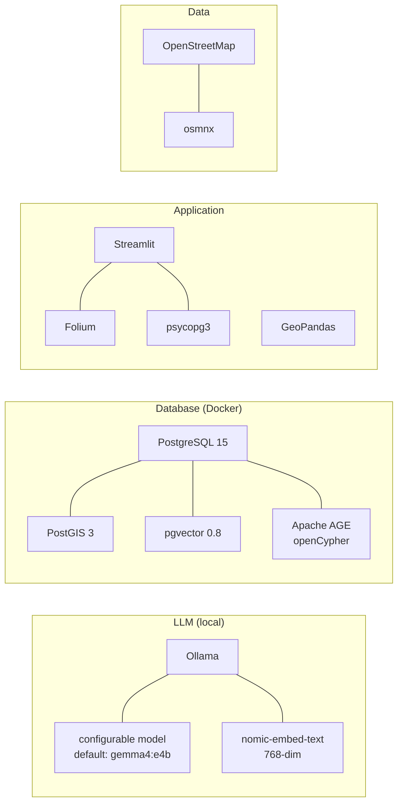

# Geo-Agentic Spatial Search

A natural language spatial search application for Adelaide, South Australia. Ask questions in plain English and get results plotted on an interactive map — powered by a local LLM, PostGIS, pgvector hybrid RAG, and an Apache AGE property graph.

Based on the architecture described in **GeoAgentic-RAG: A Multi-Agent framework for autonomous geospatial reasoning and visual insight generation with LLM** (Liang et al., 2026).

---

## How It Works


```mermaid
flowchart TD
    A["User query\n(chat input)"] --> B["Hybrid RAG\npgvector cosine search\nagainst table_descriptions"]
    B --> C["Top-k table schemas\ninjected into prompt"]
    C --> D["LLM — SQL generation\nOllama local model"]
    D --> E["SQL Validator\nPostGIS whitelist\nDML rejection, auto-LIMIT"]
    E --> F["PostGIS Executor\npsycopg3"]
    F --> G["GeoDataFrame"]
    G --> H["Spatial Analysis Agent\nstats + LLM summary\n+ follow-up suggestions"]
    H --> I["Chat panel\nsummary + SQL + stats"]
    G --> J["Folium Map\npersistent, always visible"]

    subgraph db ["PostgreSQL 15 (Docker)"]
        PG[("PostGIS\n12 osm_* tables\nosm_all view")]
        VEC[("pgvector\ntable_descriptions")]
        AGE[("Apache AGE\nosm_spatial graph")]
    end

    F --> PG
    B --> VEC
    D -.->|"place names resolved\nvia SQL subquery"| PG
```

### Query pipeline — step by step

1. **User types a question** in the chat panel, e.g. *"Show restaurants within 2km of Glenelg Beach"*
2. **Hybrid RAG** embeds the query with `nomic-embed-text` and performs a pgvector cosine search against `table_descriptions` to retrieve the 4 most relevant table schemas (~800 tokens instead of ~3,000)
3. **LLM generates PostGIS SQL** — place names like "Glenelg Beach" are resolved entirely inside the database via subqueries against `osm_all` and `osm_boundaries`. No geocoder, no hardcoded coordinates:
   ```sql
   WHERE ST_DWithin(
       r.geometry::geography,
       (SELECT ST_Centroid(geometry) FROM osm_all
        WHERE name ILIKE '%Glenelg%' LIMIT 1)::geography,
       2000
   )
   ```
4. **SQL Validator** checks the query against a PostGIS function whitelist, rejects any DML/DDL, and auto-injects a LIMIT if missing
5. **PostGIS Executor** runs the query via psycopg3 and returns a GeoDataFrame
6. **Spatial Analysis Agent** computes statistics (count, distances, areas, top attribute values) and calls a second LLM pass to produce a natural-language summary plus 3 contextual follow-up suggestions
7. **Map** updates with the new results; the chat panel shows the summary, SQL, stats, and clickable follow-up chips

> **Device location ("near me" queries):** the only case where coordinates are injected into the prompt at runtime is when the user asks *"find X near me"*. The app requests GPS from the browser via `streamlit-js-eval` and passes those coordinates to the LLM.

---

## Architecture


```mermaid
graph TB
    subgraph frontend ["Streamlit App (app.py)"]
        CHAT["Chat panel\n40% width\nconversation history\nfollow-up chips"]
        MAP["Folium map\n60% width\nalways persistent"]
    end

    subgraph pipeline ["Core Pipeline"]
        RAG["core/rag.py\nHybridRAG\npgvector cosine search"]
        LLM["core/llm.py\nPostGIS SQL generation\nDB-only place resolution\nself-correction × 3"]
        VAL["core/validator.py\nPostGIS function whitelist\nDML rejection, auto-LIMIT"]
        EXE["core/executor.py\npsycopg3 + PostGIS\nGeoDataFrame output"]
        ANA["core/analyst.py\nSpatialAnalyst\nstats + LLM summary\nfollow-up suggestions"]
        SCH["core/schema.py\ninformation_schema\ngeometry_columns"]
        GRA["core/graph.py\nApache AGE\nopenCypher interface"]
    end

    subgraph db ["PostgreSQL 15 (Docker)"]
        POSTGIS[("PostGIS\nosm_schools\nosm_hospitals\nosm_restaurants\nosm_pharmacies\nosm_roads\nosm_waterways\nosm_railways\nosm_parks\nosm_buildings\nosm_landuse\nosm_natural\nosm_boundaries\nosm_all (view)")]
        PGVEC[("pgvector\ntable_descriptions\nvector(768)")]
        AGE_DB[("Apache AGE\nosm_spatial graph\nSchool/Park/Hospital nodes\nNEAR / WITHIN edges")]
    end

    subgraph models ["Ollama (local)"]
        SQL_MODEL["SQL model\nOLLAMA_MODEL"]
        EMBED["nomic-embed-text\n768-dim embeddings"]
        ANA_MODEL["Analysis model\nANALYSIS_MODEL\n(optional cloud model)"]
    end

    CHAT -->|"user query"| RAG
    RAG -->|"embed query"| EMBED
    EMBED --> PGVEC
    PGVEC -->|"top-k table names"| RAG
    RAG -->|"filtered schema"| LLM
    SCH -->|"full schema fallback"| LLM
    LLM -->|"generate SQL"| SQL_MODEL
    SQL_MODEL --> VAL
    VAL --> EXE
    EXE --> POSTGIS
    POSTGIS --> EXE
    EXE -->|"GeoDataFrame"| ANA
    ANA -->|"stats + prompt"| ANA_MODEL
    ANA_MODEL -->|"summary"| CHAT
    EXE -->|"GeoDataFrame"| MAP
    GRA --> AGE_DB
```

---

## Tech Stack


```mermaid
graph LR
    subgraph llm_stack ["LLM (local)"]
        OLLAMA["Ollama"]
        MODEL["configurable model\ndefault: gemma4:e4b"]
        EMBED2["nomic-embed-text\n768-dim"]
    end

    subgraph db_stack ["Database (Docker)"]
        PG15["PostgreSQL 15"]
        POSTGIS2["PostGIS 3"]
        PGVEC2["pgvector 0.8"]
        AGE2["Apache AGE\nopenCypher"]
    end

    subgraph app_stack ["Application"]
        ST["Streamlit"]
        FOL["Folium"]
        PSYCOPG["psycopg3"]
        GEOPANDAS["GeoPandas"]
    end

    subgraph data_stack ["Data"]
        OSM["OpenStreetMap"]
        OSMNX["osmnx"]
    end

    OLLAMA --- MODEL
    OLLAMA --- EMBED2
    PG15 --- POSTGIS2
    PG15 --- PGVEC2
    PG15 --- AGE2
    ST --- FOL
    ST --- PSYCOPG
    OSM --- OSMNX
```

---

## Dataset

Adelaide, South Australia — 12 OSM layers:

| Table | Geometry | Description |
|---|---|---|
| `osm_schools` | Point / Polygon | Schools and educational institutions |
| `osm_hospitals` | Point / Polygon | Hospitals and medical centres |
| `osm_restaurants` | Point / Polygon | Restaurants, cafes, pubs, bars |
| `osm_pharmacies` | Point / Polygon | Pharmacies |
| `osm_roads` | LineString | Motorways, primary, secondary, residential roads |
| `osm_waterways` | LineString | Rivers, streams, canals |
| `osm_railways` | LineString | Railway lines |
| `osm_parks` | Polygon | Parks, gardens, nature reserves |
| `osm_buildings` | Polygon | Buildings (sampled to 5,000) |
| `osm_landuse` | Polygon | Land use zones |
| `osm_natural` | Polygon | Water bodies, woods, wetlands |
| `osm_boundaries` | MultiPolygon | Administrative boundaries (LGA + suburb level) |

Plus `osm_all` — a unified view across all 12 tables used for place-name resolution subqueries.

---

## Prerequisites

| Dependency | Version | Purpose |
|---|---|---|
| Python | 3.11+ | Runtime |
| Docker | 24+ | PostgreSQL + PostGIS + pgvector + AGE container |
| Docker Compose | v2 | Container orchestration |
| Ollama | latest | Local LLM + embedding model server |

### Install Docker

- **macOS / Windows:** [Docker Desktop](https://www.docker.com/products/docker-desktop/)
- **Linux:** `curl -fsSL https://get.docker.com | sh`

### Install Ollama

```bash
# macOS
brew install ollama

# Linux
curl -fsSL https://ollama.com/install.sh | sh
```

---

## Quick Start

The setup script handles everything — virtual environment, Docker build, model pulls, and data load:

```bash
git clone <repo-url> geospatial
cd geospatial
chmod +x setup.sh
./setup.sh
```

Then start the app:

```bash
# Ensure Ollama is running
ollama serve &

source .venv/bin/activate
streamlit run app.py
```

Open [http://localhost:8501](http://localhost:8501).

---

## Manual Setup

Step-by-step if you prefer not to use `setup.sh`:

```bash
# 1. Create and activate virtual environment
python3 -m venv .venv
source .venv/bin/activate   # Windows: .venv\Scripts\activate

# 2. Install Python dependencies
pip install -r requirements.txt

# 3. Copy environment config
cp .env.example .env
# Edit .env if you want a different model or DB password

# 4. Build and start PostgreSQL (PostGIS + pgvector + AGE)
#    First build takes 5-10 minutes (compiles pgvector from source)
docker compose build
docker compose up -d

# 5. Pull Ollama models
ollama pull gemma4:e4b          # SQL generation model
ollama pull nomic-embed-text    # Embedding model for RAG

# 6. Download OSM data, build pgvector index, build AGE graph
python data/setup_db.py

# 7. Run the app
streamlit run app.py
```

---

## Configuration

All configuration via `.env` (copied from `.env.example`):

| Variable | Default | Description |
|---|---|---|
| `OLLAMA_HOST` | `http://localhost:11434` | Ollama server URL |
| `OLLAMA_MODEL` | `gemma4:e4b` | Model for SQL generation |
| `EMBEDDING_MODEL` | `nomic-embed-text` | Model for pgvector schema RAG |
| `ANALYSIS_MODEL` | *(empty)* | Optional cloud model for spatial analysis (e.g. `gpt-4o`). Falls back to `OLLAMA_MODEL` if blank |
| `ANALYSIS_API_KEY` | *(empty)* | API key for `ANALYSIS_MODEL` |
| `DB_HOST` | `localhost` | PostgreSQL host |
| `DB_PORT` | `5432` | PostgreSQL port |
| `DB_NAME` | `geospatial` | Database name |
| `DB_USER` | `geo` | Database user |
| `DB_PASSWORD` | `geo` | Database password |

---

## Database management

```bash
# Start the database
docker compose up -d

# Stop the database (data persisted in pgdata volume)
docker compose down

# Rebuild from scratch (deletes all data)
docker compose down -v
docker compose up -d
python data/setup_db.py

# Re-run only data load (skip graph build)
python data/setup_db.py --skip-graph

# Re-run only embeddings + graph (skip OSM download)
python data/setup_db.py --skip-download

# View database logs
docker compose logs -f db
```

---

## Example Queries

```
Find 5 schools near Adelaide CBD
Show me restaurants within 2km of Glenelg Beach
What are the largest parks by area?
Show all primary roads
How many restaurants are there by type?
Find parks with 'creek' in the name
Show me hospitals near the University of Adelaide
Which roads intersect parks?
Show all pharmacies in Norwood
Find buildings near the River Torrens
Show waterways in Port Adelaide
Find parks near me
```

---

## Project Structure

```
geospatial/
├── app.py                  Streamlit chat + map application
├── Dockerfile              PG 15 + AGE + pgvector + PostGIS image
├── docker-compose.yml      Single-container service definition
├── setup.sh                One-command bootstrap script
├── requirements.txt        Python dependencies
├── .env.example            Environment variable template
├── PLAN.md                 Full architecture and implementation plan
│
├── core/
│   ├── db.py               psycopg3 connection pool (AGE search_path config)
│   ├── schema.py           PostgreSQL schema introspection
│   ├── rag.py              Hybrid RAG — pgvector cosine schema retrieval
│   ├── llm.py              PostGIS SQL generation + analysis LLM call
│   ├── validator.py        SQL validation — PostGIS whitelist, DML rejection
│   ├── executor.py         PostGIS query execution → GeoDataFrame
│   ├── analyst.py          Spatial stats + LLM summary + follow-up suggestions
│   ├── graph.py            Apache AGE openCypher interface
│   └── geocoder.py         get_adelaide_center() — default map center only
│
├── data/
│   └── setup_db.py         OSM download → PostGIS + embeddings + AGE graph
│
└── docker/
    └── initdb.sql          Extension bootstrap + table DDL (runs on first start)
```

---

## Key Design Decisions

**Place name resolution is done entirely inside PostGIS.** There is no geocoder in the query path. When the LLM generates SQL for a query like *"restaurants near Glenelg Beach"*, it produces a subquery:
```sql
(SELECT ST_Centroid(geometry) FROM osm_all WHERE name ILIKE '%Glenelg%' LIMIT 1)
```
Coordinates are sourced from the same database as the results — consistent, accurate, and requiring no external service.

**Hybrid RAG reduces prompt token usage by ~75%.** Instead of injecting all 12 table schemas (~3,000 tokens) into every LLM call, the query is embedded with `nomic-embed-text` and only the top-4 most relevant table schemas (~800 tokens) are retrieved via pgvector cosine search.

**Apache AGE uses openCypher** — the same query language as AWS Neptune's openCypher endpoint. The graph model (node labels, edge types, property names) is directly portable to Neptune by swapping the connection layer.

**`::geography` cast always** — PostGIS distance queries always cast to `::geography` for native metre distances. No `* 111320` degree-to-metre heuristic.

---

## Known Limitations

- The LLM occasionally generates invalid SQL. The validator catches most issues and the system retries up to 3 times with the error fed back for self-correction.
- Place name resolution depends on the named feature existing in the OSM data. Very new or obscure places may not be found and the subquery will return `NULL`, causing the spatial filter to match nothing.
- The `osm_buildings` layer is sampled to 5,000 features to keep data load time reasonable.
- The AGE graph build is bounded (NEAR edges limited to school↔park and school↔hospital pairs within 500m) to keep setup time manageable.

---

## License

This project is licensed under the Business Source License 1.1 (`BUSL-1.1`). Non-production use is permitted under the license terms; production or commercial use requires separate authorisation until the applicable Change Date. See [LICENSE](LICENSE) for details.

Map data from [OpenStreetMap](https://www.openstreetmap.org/copyright) contributors, available under the [ODbL](https://opendatacommons.org/licenses/odbl/).
